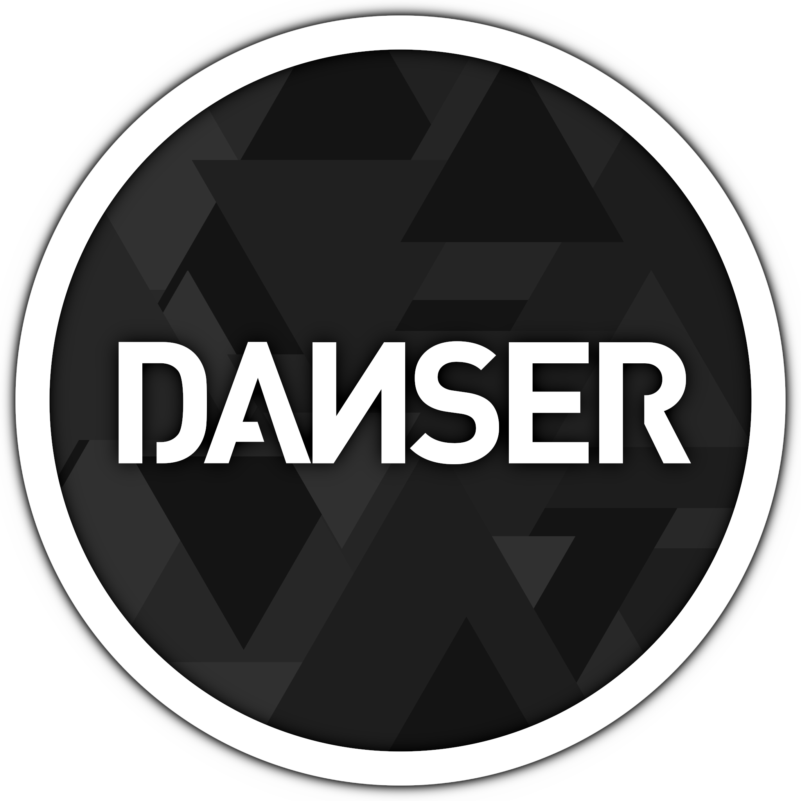

<p align="center">
  
</p>

# danser-mac

**Неофициальный порт [danser-go](https://github.com/Wieku/danser-go) под macOS** (Apple Silicon и Intel, universal-сборка).

> Это форк. Весь основной код — заслуга [Wieku](https://github.com/Wieku) и контрибьюторов danser-go.
> Баги, специфичные для macOS, пишите сюда, а не в оригинальный репозиторий.

danser — это визуализатор карт osu!standard: можно смотреть реплеи, cursordance, knockout'ы и рендерить всё это в mp4.

## Что добавлено в этом форке

- 🍎 Нативная сборка под macOS 12+ — один `danser.app` для M1/M2/M3/M4 и Intel
- 🎮 Поддержка **osu!lazer**: встроенный `lazer-bridge` подтягивает карты, скины и реплеи из библиотеки lazer — ставить .NET не нужно
- 🎬 ffmpeg уже внутри — рендер в видео работает из коробки
- 📂 Открытие `.osr` и `.osz` двойным кликом через Finder
- Данные и настройки хранятся в `~/Library/Application Support/danser`

## Установка

1. Скачайте `danser-macos-universal.zip` из [Releases](https://github.com/LooNuH-dev/danser-mac/releases)
2. Распакуйте и перетащите `danser.app` в «Программы»
3. Приложение не подписано Apple, поэтому при первом запуске macOS его заблокирует. Снимите карантин:

```bash
xattr -dr com.apple.quarantine /Applications/danser.app
```

   Либо: правый клик по `danser.app` → «Открыть» → «Открыть».

4. Запускайте. В лаунчере укажите папку osu! или импортируйте библиотеку osu!lazer.

### Запуск из терминала

```bash
/Applications/danser.app/Contents/MacOS/danser -h
```

Все аргументы командной строки — как в [оригинальном README](danser/README.md).

## Сборка из исходников

Нужны: Xcode Command Line Tools, Go 1.24+, cmake, git, curl. Всё остальное (SDL3, BASS, libyuv, ffmpeg, .NET SDK) скачивается локально в `./deps`, в систему ничего не ставится.

```bash
./setup-deps.sh
```

```bash
./build-mac.sh 0.1.0
```

Результат: `dist/danser.app` и `dist/danser-macos-universal.zip`.

## Структура

| Путь | Что это |
|---|---|
| `danser/` | исходники danser-go с правками под macOS |
| `lazer-bridge/` | C#-утилита для чтения realm-базы osu!lazer |
| `setup-deps.sh` | сборка/загрузка нативных зависимостей (universal) |
| `build-mac.sh` | сборка universal-бинарника и `.app` |

## Известные ограничения

- macOS считает OpenGL устаревшим; на всякий случай обновите систему, если видите артефакты
- На Intel-маках рекомендуется macOS 15+ (часть сторонних библиотек собрана под неё)

## Лицензия и благодарности

Код распространяется под лицензией оригинального проекта — см. [danser/LICENSE](danser/LICENSE) и [danser/CREDITS.md](danser/CREDITS.md).
Оригинал: [Wieku/danser-go](https://github.com/Wieku/danser-go) · Discord danser: https://discord.gg/UTPvbe8
